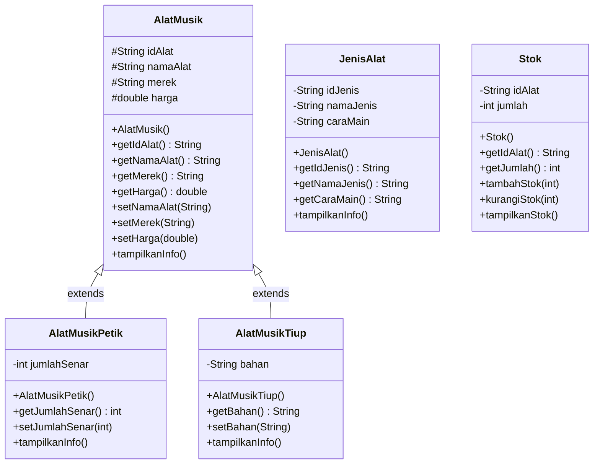

# Pemrograman Berorientasi Objek

## Sistem Manajemen Alat Musik (CLI)

---

## Identitas Mahasiswa

* **Nama** : Harits
* **NIM** : 2509116048
* **Program Studi** : Sistem Informasi

---

## Penjelasan Studi Kasus

Studi kasus yang diangkat adalah **Sistem Manajemen Alat Musik**. Sistem ini dibuat untuk membantu pengelolaan data berbagai alat musik serta jumlah stok yang tersedia.

Aplikasi memiliki beberapa fungsi utama, yaitu:

1. **Manajemen Data Alat Musik**

   * Menampilkan daftar alat musik.
   * Menambahkan data alat musik baru.
   * Mengubah data alat musik.
   * Menghapus data alat musik.
   * Mencari alat musik berdasarkan nama.

2. **Pengelompokan Jenis Alat Musik**

   * Alat musik petik seperti gitar dan ukulele.
   * Alat musik tiup seperti seruling dan saksofon.
   * Setiap jenis alat musik memiliki atribut khusus sesuai karakteristiknya.

3. **Manajemen Stok**

   * Menampilkan stok setiap alat musik.
   * Menambahkan jumlah stok.
   * Mengurangi jumlah stok.
   * Sistem akan mengecek apakah stok mencukupi sebelum dilakukan pengurangan.

4. **Penerapan Konsep PBO**

   * Menggunakan class dan object.
   * Menggunakan constructor.
   * Menggunakan encapsulation melalui getter dan setter.
   * Menggunakan inheritance melalui superclass dan subclass.
   * Menggunakan polymorphism melalui method overriding.
   * Menggunakan `ArrayList` untuk menyimpan data alat musik dan stok.

---

## Diagram Kelas & Hierarki Class

Program ini menggunakan **satu rantai pewarisan (Inheritance)** pada bagian pengelompokan alat musik.

### Diagram Hubungan Class



### Penjelasan Hierarki Class

1. **Super-Class `AlatMusik`**

   Merupakan superclass yang menjadi dasar untuk berbagai jenis alat musik. Class ini menyimpan atribut umum seperti `idAlat`, `namaAlat`, `merek`, dan `harga`.

2. **Sub-Class `AlatMusikPetik`**

   Merupakan subclass dari `AlatMusik` yang digunakan untuk alat musik yang dimainkan dengan cara dipetik. Class ini memiliki atribut tambahan berupa `jumlahSenar`.

   Contoh alat musik yang dapat menggunakan class ini adalah gitar dan ukulele.

3. **Sub-Class `AlatMusikTiup`**

   Merupakan subclass dari `AlatMusik` yang digunakan untuk alat musik yang dimainkan dengan cara ditiup. Class ini memiliki atribut tambahan berupa `bahan`.

   Contoh alat musik yang dapat menggunakan class ini adalah seruling dan saksofon.

4. **Class `JenisAlat`**

   Digunakan untuk menyimpan informasi mengenai jenis alat musik, seperti nama jenis dan cara memainkan alat musik.

5. **Class `Stok`**

   Digunakan untuk mengelola jumlah stok setiap alat musik. Class ini memiliki method untuk menambah dan mengurangi stok.

6. **Class `Main`**

   Merupakan class utama yang digunakan untuk menjalankan program. Class ini menangani menu, input pengguna, `ArrayList`, serta proses CRUD dan pengelolaan stok.

---

## Penjelasan Bagian Kode Penerapan Inheritance

Penerapan konsep pewarisan (*Inheritance*) pada program dilakukan dengan menjadikan `AlatMusik` sebagai superclass dan `AlatMusikPetik` serta `AlatMusikTiup` sebagai subclass.

### 1. Penggunaan Sintaks `extends`

Pewarisan class dilakukan menggunakan kata kunci `extends`.

**`AlatMusikPetik` mewarisi `AlatMusik`:**

```java
public class AlatMusikPetik extends AlatMusik {
    private int jumlahSenar;
}
```

**`AlatMusikTiup` mewarisi `AlatMusik`:**

```java
public class AlatMusikTiup extends AlatMusik {
    private String bahan;
}
```

Dengan menggunakan `extends`, subclass dapat menggunakan atribut dan method yang berasal dari superclass `AlatMusik`.

---

### 2. Penggunaan `super()`

Constructor pada subclass memanggil constructor superclass menggunakan `super()`.

Contohnya pada `AlatMusikPetik`:

```java
public AlatMusikPetik(
        String idAlat,
        String namaAlat,
        String merek,
        double harga,
        int jumlahSenar) {

    super(idAlat, namaAlat, merek, harga);

    this.jumlahSenar = jumlahSenar;
}
```

`super()` digunakan untuk menginisialisasi atribut yang diwarisi dari class `AlatMusik`, sedangkan `jumlahSenar` merupakan atribut khusus milik `AlatMusikPetik`.

---

### 3. Penerapan Polimorfisme dengan `@Override`

Program juga menerapkan **polymorphism** melalui method overriding.

Pada superclass `AlatMusik` terdapat method:

```java
public void tampilkanInfo() {
    System.out.println("ID       : " + idAlat);
    System.out.println("Nama     : " + namaAlat);
    System.out.println("Merek    : " + merek);
    System.out.println("Harga    : Rp" + harga);
}
```

Kemudian method tersebut dioverride pada `AlatMusikPetik`:

```java
@Override
public void tampilkanInfo() {
    super.tampilkanInfo();
    System.out.println("Jenis    : Alat Musik Petik");
    System.out.println("Senar    : " + jumlahSenar);
}
```

Dan pada `AlatMusikTiup`:

```java
@Override
public void tampilkanInfo() {
    super.tampilkanInfo();
    System.out.println("Jenis    : Alat Musik Tiup");
    System.out.println("Bahan    : " + bahan);
}
```

Dengan demikian, ketika method `tampilkanInfo()` dipanggil, informasi yang ditampilkan akan menyesuaikan dengan object yang digunakan.

---

## Penerapan Encapsulation

Konsep **encapsulation** diterapkan dengan membatasi akses langsung terhadap atribut class.

Contohnya pada class `Stok`:

```java
private String idAlat;
private int jumlah;
```

Atribut tersebut tidak dapat diakses langsung dari luar class. Untuk mengambil nilainya digunakan getter:

```java
public int getJumlah() {
    return jumlah;
}
```

Sedangkan untuk mengubah data digunakan method yang telah disediakan, seperti:

```java
public void tambahStok(int jumlah) {
    this.jumlah += jumlah;
}
```

Dengan cara tersebut, perubahan data stok tetap dikontrol melalui method yang tersedia pada class.

---

## Fitur Program

Program menyediakan beberapa menu utama:

```text
==============================
   SISTEM MANAJEMEN ALAT MUSIK
==============================
1. Tampilkan Alat Musik
2. Tambah Alat Musik
3. Update Alat Musik
4. Hapus Alat Musik
5. Cari Alat Musik
6. Tambah Stok
7. Kurangi Stok
8. Tampilkan Stok
0. Keluar
```

### 1. Tampilkan Alat Musik

Menampilkan seluruh data alat musik yang tersimpan dalam `ArrayList`.

### 2. Tambah Alat Musik

Pengguna dapat menambahkan alat musik baru dan memilih jenis alat musik, yaitu alat musik petik atau alat musik tiup.

### 3. Update Alat Musik

Digunakan untuk mengubah nama, merek, dan harga alat musik berdasarkan ID.

### 4. Hapus Alat Musik

Menghapus data alat musik berdasarkan ID sekaligus menghapus data stok yang berkaitan.

### 5. Cari Alat Musik

Mencari alat musik berdasarkan nama.

### 6. Tambah Stok

Menambahkan jumlah stok alat musik tertentu.

### 7. Kurangi Stok

Mengurangi stok dengan melakukan pengecekan terlebih dahulu agar jumlah stok tidak menjadi kurang dari jumlah yang tersedia.

### 8. Tampilkan Stok

Menampilkan ID alat musik beserta jumlah stok yang tersedia.

---

# Screenshot Running Program

## 1. Menu Utama

Screenshot menampilkan menu utama aplikasi Sistem Manajemen Alat Musik yang berisi pilihan untuk mengelola alat musik dan stok.


---

## 2. Daftar Alat Musik

Screenshot menampilkan data alat musik yang telah tersimpan, termasuk informasi jenis, merek, harga, dan atribut khusus dari masing-masing alat musik.


---

## 3. Tambah Alat Musik

Screenshot menunjukkan proses penambahan data alat musik baru. Pengguna dapat menentukan jenis alat musik dan mengisi data sesuai dengan jenis yang dipilih.


---

## 4. Update dan Hapus Data

Screenshot menunjukkan proses perubahan dan penghapusan data alat musik berdasarkan ID yang dimasukkan pengguna.


---

## 5. Pengelolaan Stok

Screenshot menunjukkan proses penambahan, pengurangan, dan penampilan stok alat musik.


---

## Konsep PBO yang Digunakan

Program menerapkan beberapa konsep utama Pemrograman Berorientasi Objek:

| Konsep        | Penerapan                                                           |
| ------------- | ------------------------------------------------------------------- |
| Class         | `AlatMusik`, `AlatMusikPetik`, `AlatMusikTiup`, `JenisAlat`, `Stok` |
| Object        | Object alat musik dan stok                                          |
| Constructor   | Constructor pada setiap class                                       |
| Encapsulation | `private`, getter, dan setter                                       |
| Inheritance   | `AlatMusikPetik` dan `AlatMusikTiup` mewarisi `AlatMusik`           |
| Polymorphism  | Method `tampilkanInfo()` menggunakan overriding                     |
| ArrayList     | Menyimpan data alat musik dan stok                                  |
| Looping       | `for` dan `do-while`                                                |
| Percabangan   | `if`, `else`, dan `switch`                                          |

---

## Struktur Project

```text
SistemManajemenAlatMusik
│
├── src
│   └── main
│       └── java
│           ├── main
│           │   └── Main.java
│           │
│           └── model
│               ├── AlatMusik.java
│               ├── AlatMusikPetik.java
│               ├── AlatMusikTiup.java
│               ├── JenisAlat.java
│               └── Stok.java
│
├── screenshot
│   ├── menu-utama.png
│   ├── daftar-alat-musik.png
│   ├── tambah-alat-musik.png
│   ├── update-hapus.png
│   └── stok.png
│
└── README.md
```
